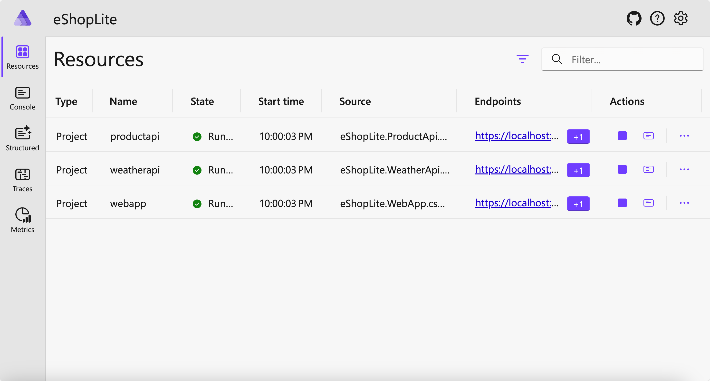
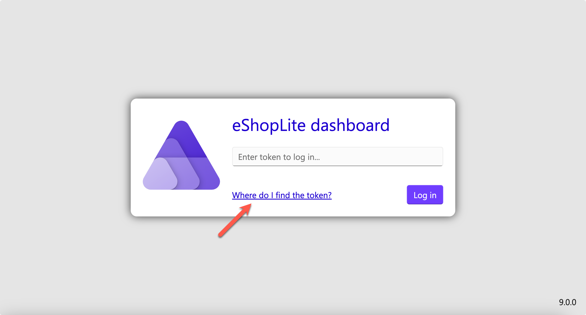
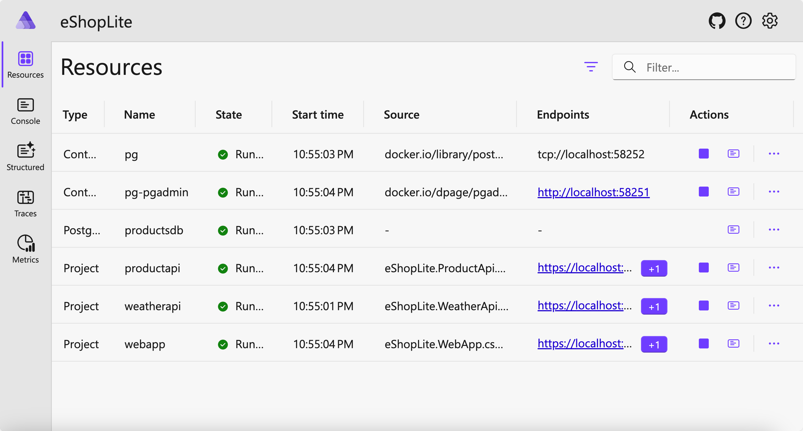

# STEP 04: Container Orchestration with .NET Aspire

In this step, you'll orchestrate all apps using [.NET Aspire](https://learn.microsoft.com/dotnet/aspire/get-started/aspire-overview).

## Prerequisites

- Install [.NET SDK 9](https://dotnet.microsoft.com/download/dotnet/9.0)
- Install [PowerShell 7](https://learn.microsoft.com/powershell/scripting/install/installing-powershell)
- Install [Docker Desktop](https://docs.docker.com/get-started/introduction/get-docker-desktop/)
- Install [Visual Studio Code](https://code.visualstudio.com/)

To verify the installation of each prerequisite, refer to the document [STEP 00: Setting Up the Development Environment](./step-00.md).

## Copy Base Project

You can continue using the app from the previous step or copy a fresh version from the save point using the commands below. To copy a fresh version, use the following commands:

1. Open a terminal and execute the following commands sequentially to create the practice directory and copy the base project:

    ```bash
    # Bash/Zsh
    REPOSITORY_ROOT=$(git rev-parse --show-toplevel)
    cd $REPOSITORY_ROOT

    mkdir -p workshop && cp -a save-points/step-00/. workshop/
    ```

    ```powershell
    # PowerShell
    $REPOSITORY_ROOT = git rev-parse --show-toplevel
    cd $REPOSITORY_ROOT

    New-Item -Type Directory -Path workshop -Force && Copy-Item -Path ./save-points/step-00/* -Destination ./workshop -Recurse -Force
    ```

1. Build the entire project using the following command:

    ```bash
    cd $REPOSITORY_ROOT/workshop

    dotnet restore && dotnet build
    ```

## Adding a .NET Aspire Orchestration Project

Unlike the previous practice, this time you will use .NET Aspire for container orchestration.

Once you install the .NET Aspire orchestration project, the overall solution structure will change as shown below:

```text
eShopLite
└── src
    ├── eShopLite.AppHost
    │   ├── eShopLite.WebApp
    │   ├── eShopLite.ProductApi
    │   └── eShopLite.WeatherApi
    ├── eShopLite.ServiceDefaults
    ├── eShopLite.WebApp
    │   ├── eShopLite.DataEntities
    │   └── eShopLite.ServiceDefaults
    ├── eShopLite.WeatherApi
    │   ├── eShopLite.DataEntities
    │   └── eShopLite.ServiceDefaults
    └── eShopLite.ProductApi
        ├── eShopLite.ProductData
        │   └── eShopLite.DataEntities
        └── eShopLite.ServiceDefaults
```

### Add the .NET Aspire Project

1. Run the following command to add the .NET Aspire orchestrator project:

    ```bash
    dotnet new aspire-apphost -n eShopLite.AppHost -o src/eShopLite.AppHost
    dotnet sln eShopLite.sln add ./src/eShopLite.AppHost
    ```

1. Execute the following command to add all apps to the .NET Aspire orchestrator project:

    ```bash
    dotnet add ./src/eShopLite.AppHost reference ./src/eShopLite.WebApp
    dotnet add ./src/eShopLite.AppHost reference ./src/eShopLite.ProductApi
    dotnet add ./src/eShopLite.AppHost reference ./src/eShopLite.WeatherApi
    ```

1. Use the command below to add the .NET Aspire base service project:

    ```bash
    dotnet new aspire-servicedefaults -n eShopLite.ServiceDefaults -o src/eShopLite.ServiceDefaults
    dotnet sln eShopLite.sln add ./src/eShopLite.ServiceDefaults
    ```

1. Run the following command to add the .NET Aspire base service project to each app:

    ```bash
    dotnet add ./src/eShopLite.WebApp reference ./src/eShopLite.ServiceDefaults
    dotnet add ./src/eShopLite.ProductApi reference ./src/eShopLite.ServiceDefaults
    dotnet add ./src/eShopLite.WeatherApi reference ./src/eShopLite.ServiceDefaults
    ```

### Modify `eShopLite.WebApp` Project

1. Open `src/eShopLite.WebApp/Program.cs`, find `var builder = WebApplication.CreateBuilder(args);` and add the following content immediately below:

    ```csharp
    builder.AddServiceDefaults();
    ```

   > This enables the use of default services provided by .NET Aspire.

2. Update the following code:

    ```csharp
    // Before
    builder.Services.AddHttpClient<ProductApiClient>(client =>
    {
        client.BaseAddress = new("http://localhost:5051");
    });
    
    builder.Services.AddHttpClient<WeatherApiClient>(client =>
    {
        client.BaseAddress = new("http://localhost:5050");
    });
    ```

    ```csharp
    // After
    builder.Services.AddHttpClient<ProductApiClient>(client =>
    {
        client.BaseAddress = new("https+http://productapi");
    });
    
    builder.Services.AddHttpClient<WeatherApiClient>(client =>
    {
        client.BaseAddress = new("https+http://weatherapi");
    });
    ```

   > Modify to use service discovery provided by .NET Aspire.

3. Add the following content right before `app.Run();`:

    ```csharp
    app.MapDefaultEndpoints();
    ```

   > Enables the use of the health check endpoint provided from .NET Aspire.

### Modify `eShopLite.ProductApi` Project

1. Open `src/eShopLite.ProductApi/Program.cs`, find `var builder = WebApplication.CreateBuilder(args);` and add the following content immediately below:

    ```csharp
    builder.AddServiceDefaults();
    ```

1. Add the following line right before `app.Run();`:

    ```csharp
    app.MapDefaultEndpoints();
    ```

### Modify `eShopLite.WeatherApi` Project

> **🚨🚨🚨 도전‼️ 🚨🚨🚨**
> 
> Like modifying the `eShopLite.ProductApi` project, modify the `eShopLite.WeatherApi` project.

### Modify `eShopLite.AppHost` Project

1. Open `src/eShopLite.AppHost/Program.cs`, find `var builder = DistributedApplication.CreateBuilder(args);` and add the following lines immediately below:

    ```csharp
    var productapi = builder.AddProject<Projects.eShopLite_ProductApi>("productapi");
    var weatherapi = builder.AddProject<Projects.eShopLite_WeatherApi>("weatherapi");
    ```

   > Add both `ProductApi` and `WeatherApi` to the orchestrator project, `AppHost`.

1. Add the following content in the subsequent line:

    ```csharp
    builder.AddProject<Projects.eShopLite_WebApp>("webapp")
           .WithExternalHttpEndpoints()
           .WithReference(productapi)
           .WithReference(weatherapi)
           .WaitFor(productapi)
           .WaitFor(weatherapi);
    ```

   > Configure the `WebApp` project in the orchestrator, `AppHost`
   > 
   > - `.WithExternalHttpEndpoints()`: exposes for the public access.
   > - `.WithReference(productapi)`: lets `WebApp` discover `ProductApi`.
   > - `.WithReference(weatherapi)`: lets `WebApp` discover `WeatherApi`.
   > - `.WaitFor(productapi)`: lets `WebApp` wait for `ProductApi` being up and running.
   > - `.WaitFor(weatherapi)`: lets `WebApp` wait for `WeatherApi` being up and running.

### Run the .NET Aspire Orchestrator

1. Execute the following command to run the .NET Aspire orchestrator:

    ```bash
    cd $REPOSITORY_ROOT/workshop

    dotnet watch run --project ./src/eShopLite.AppHost
    ```

1. A web browser will automatically open, displaying the dashboard. The dashboard will show `productapi`, `weatherapi` and `webapp` resources.

    

   > You might be seeing this login screen.
   > 
   > 
   > 
   > Click the link and follow the instructions to get into the dashboard.

1. Click each endpoint of `productapi` and `weatherapi` to see their respective OpenAPI document.
1. Click the enpoint of `webapp` to see the web application. Navigate to both `/products` and `/weather` pages and see whether they are properly up.
1. Type `Ctrl`+`C` in the terminal and stop the .NET Aspire orchestrator.

## Replace Database through .NET Aspire Orchestrator

Let's change the database from SQLite to PostgreSQL.

### Modify `eShopLite.AppHost` Project

1. Run the following command to add the PostgreSQL package to the `eShopLite.AppHost` project.

    ```bash
    cd $REPOSITORY_ROOT/workshop

    dotnet add ./src/eShopLite.AppHost package Aspire.Hosting.PostgreSQL
    ```

1. Open `src/eShopLite.AppHost/Program.cs`, find `var builder = DistributedApplication.CreateBuilder(args);` and add the following content immediately below:

    ```csharp
    var productsdb = builder.AddPostgres("pg")
                            .WithPgAdmin()
                            .AddDatabase("productsdb");
    ```

   > It adds a PostgreSQL database.
   > 
   > - `.AddPostgres("pg")`: adds a container for PostgreSQL database.
   > - `.WithPgAdmin()`: adds a container for PGAdmin dashboard.
   > - `.AddDatabase("productsdb")`: adds a new database called `productsdb`.

1. Modify the following content:

    ```csharp
    // Before
    var productapi = builder.AddProject<Projects.eShopLite_ProductApi>("productapi");
    ```

    ```csharp
    // After
    var productapi = builder.AddProject<Projects.eShopLite_ProductApi>("productapi")
                            .WithReference(productsdb);
    ```

   > It adds the PostgreSQL database to the `ProductApi` project.
   > 
   > - `.WithReference(productsdb)`: let `ProductApi` discover the PostgreSQL database, `productsdb`.

### Modify `eShopLite.ProductApi` Project

1. Run the following command to add a PostgreSQL database packaget to the `eShopLite.ProductApi` project.

    ```bash
    cd $REPOSITORY_ROOT/workshop

    dotnet add ./src/eShopLite.ProductApi package Aspire.Npgsql.EntityFrameworkCore.PostgreSQL
    ```

1. Open `src/eShopLite.ProductApi/appsettings.json`, remove the `ConnectionStrings` section completely. The `appsettings.json` file should look like:

    ```json
    {
      "Logging": {
        "LogLevel": {
          "Default": "Information",
          "Microsoft.AspNetCore": "Warning"
        }
      },
    
      "AllowedHosts": "*"
    }
    ```

   > Make sure there's no `ConnectionStrings` section any longer.

1. Open the `src/eShopLite.ProductApi/Program.cs` file and modify it as follows:

    ```csharp
    // Before
    builder.Services.AddDbContext<ProductDbContext>(options =>
    {
        var connectionString = builder.Configuration.GetConnectionString("ProductsContext") ?? throw new InvalidOperationException("Connection string 'ProductsContext' not found.");
        options.UseSqlite(connectionString);
    });
    ```

    ```csharp
    // After
    builder.AddNpgsqlDbContext<ProductDbContext>("productsdb");
    ```

   > Update to use the PostgreSQL database connection string.
   > 
   > - The name `productsdb`is the reference name that `AppHost` uses.

### Run the .NET Aspire Orchestrator

1. Execute the following command to run the .NET Aspire orchestrator:

    ```bash
    cd $REPOSITORY_ROOT/workshop

    dotnet watch run --project ./src/eShopLite.AppHost
    ```

1. A web browser will automatically open, displaying the dashboard. The dashboard will show `pg`, `pg-pgadmin`, `productsdb`, `productapi`, `weatherapi` and `webapp` resources.

    

   > You might be seeing the login screen.
   > 
   > 
   > 
   > Click the link and follow the instructions so that you can access to the dashboard.

1. Click the endpoint of `pg-pgadmin` to see the admin dashboard for the PostgreSQL database.
1. Click the endpoint of both `productapi` and `weatherapi` to see respective OpenAPI document.
1. Click the endpoint of `webapp` to see the web app. Navigate to both `/products` and `/weather` pages to see they are properly showing up.
1. Type `Ctrl`+`C` in the terminal to to stop the .NET Aspire orchestrator.

---

Congratulations! You've completed the **Container Orchestration with .NET Aspire** practice. Proceed to the next step: [STEP 05: Integration Testing with .NET Aspire](./step-05.md).

**Disclaimer**:  
This document has been translated using machine-based AI translation services. While efforts are made to ensure accuracy, please note that automated translations may contain errors or inaccuracies. The original document in its native language should be regarded as the authoritative source. For critical information, professional human translation is advised. We are not responsible for any misunderstandings or misinterpretations resulting from the use of this translation.