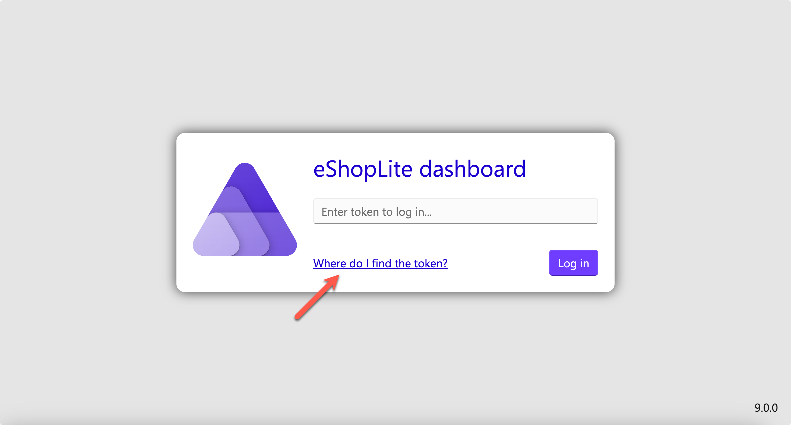

# STEP 04: การจัดการคอนเทนเนอร์ด้วย .NET Aspire

ในขั้นตอนนี้ เราจะใช้ [.NET Aspire](https://learn.microsoft.com/dotnet/aspire/get-started/aspire-overview) ในการจัดการทุกแอปพลิเคชัน

## สิ่งที่ต้องเตรียม

- ติดตั้ง [.NET SDK 9](https://dotnet.microsoft.com/download/dotnet/9.0)
- ติดตั้ง [PowerShell 7](https://learn.microsoft.com/powershell/scripting/install/installing-powershell)
- ติดตั้ง [Docker Desktop](https://docs.docker.com/get-started/introduction/get-docker-desktop/)
- ติดตั้ง [Visual Studio Code](https://code.visualstudio.com/)

ตรวจสอบการติดตั้งตามขั้นตอนในเอกสาร [STEP 00: ตั้งค่าพื้นฐานสำหรับการพัฒนา](./step-00.md)

## คัดลอกโปรเจกต์พื้นฐาน

คุณสามารถใช้แอปพลิเคชันจากขั้นตอนก่อนหน้า หรือคัดลอกโปรเจกต์ใหม่จากจุดบันทึกโดยใช้คำสั่งด้านล่าง:

1. เปิดเทอร์มินัล แล้วรันคำสั่งด้านล่างเพื่อสร้างไดเรกทอรีสำหรับการฝึก และคัดลอกโปรเจกต์พื้นฐาน:

    ```bash
    # Bash/Zsh
    REPOSITORY_ROOT=$(git rev-parse --show-toplevel)
    cd $REPOSITORY_ROOT

    mkdir -p workshop && cp -a save-points/step-00/. workshop/
    ```

    ```powershell
    # PowerShell
    $REPOSITORY_ROOT = git rev-parse --show-toplevel
    cd $REPOSITORY_ROOT

    New-Item -Type Directory -Path workshop -Force && Copy-Item -Path ./save-points/step-00/* -Destination ./workshop -Recurse -Force
    ```

1. รันคำสั่งด้านล่างเพื่อบิลด์โปรเจกต์ทั้งหมด:

    ```bash
    cd $REPOSITORY_ROOT/workshop

    dotnet restore && dotnet build
    ```

## เพิ่มโปรเจกต์ .NET Aspire สำหรับการจัดการคอนเทนเนอร์

แตกต่างจากขั้นตอนก่อนหน้า ในขั้นตอนนี้เราจะใช้ .NET Aspire ในการจัดการคอนเทนเนอร์

เมื่อเพิ่มโปรเจกต์ .NET Aspire แล้ว โครงสร้างของโซลูชันทั้งหมดจะเปลี่ยนไปตามภาพด้านล่าง:

```text
eShopLite
└── src
    ├── eShopLite.AppHost
    │   ├── eShopLite.WebApp
    │   ├── eShopLite.ProductApi
    │   └── eShopLite.WeatherApi
    ├── eShopLite.ServiceDefaults
    ├── eShopLite.WebApp
    │   ├── eShopLite.DataEntities
    │   └── eShopLite.ServiceDefaults
    ├── eShopLite.WeatherApi
    │   ├── eShopLite.DataEntities
    │   └── eShopLite.ServiceDefaults
    └── eShopLite.ProductApi
        ├── eShopLite.ProductData
        │   └── eShopLite.DataEntities
        └── eShopLite.ServiceDefaults
```

### เพิ่มโปรเจกต์ .NET Aspire

1. รันคำสั่งด้านล่างเพื่อเพิ่มโปรเจกต์ .NET Aspire สำหรับการจัดการคอนเทนเนอร์:

    ```bash
    dotnet new aspire-apphost -n eShopLite.AppHost -o src/eShopLite.AppHost
    dotnet sln eShopLite.sln add ./src/eShopLite.AppHost
    ```

1. รันคำสั่งด้านล่างเพื่อเพิ่มแอปพลิเคชันทั้งหมดเข้าไปในโปรเจกต์ .NET Aspire:

    ```bash
    dotnet add ./src/eShopLite.AppHost reference ./src/eShopLite.WebApp
    dotnet add ./src/eShopLite.AppHost reference ./src/eShopLite.ProductApi
    dotnet add ./src/eShopLite.AppHost reference ./src/eShopLite.WeatherApi
    ```

1. รันคำสั่งด้านล่างเพื่อเพิ่มโปรเจกต์บริการพื้นฐานของ .NET Aspire:

    ```bash
    dotnet new aspire-servicedefaults -n eShopLite.ServiceDefaults -o src/eShopLite.ServiceDefaults
    dotnet sln eShopLite.sln add ./src/eShopLite.ServiceDefaults
    ```

1. รันคำสั่งด้านล่างเพื่อเพิ่มโปรเจกต์บริการพื้นฐานให้กับแต่ละแอปพลิเคชัน:

    ```bash
    dotnet add ./src/eShopLite.WebApp reference ./src/eShopLite.ServiceDefaults
    dotnet add ./src/eShopLite.ProductApi reference ./src/eShopLite.ServiceDefaults
    dotnet add ./src/eShopLite.WeatherApi reference ./src/eShopLite.ServiceDefaults
    ```

### เพิ่มโค้ดใน `eShopLite.WebApp` 프로젝트 수정

1. `src/eShopLite.WebApp/Program.cs` 파일을 열고 `var builder = WebApplication.CreateBuilder(args);`

เพิ่มโค้ดด้านล่างทันทีหลังจากบรรทัดนี้:

    ```csharp
    builder.AddServiceDefaults();
    ```

   > ตั้งค่าให้ใช้บริการที่มาจากโปรเจกต์บริการพื้นฐาน

1. แก้ไขโค้ดด้านล่าง:

    ```csharp
    // 변경전
    builder.Services.AddHttpClient<ProductApiClient>(client =>
    {
        client.BaseAddress = new("http://localhost:5051");
    });
    
    builder.Services.AddHttpClient<WeatherApiClient>(client =>
    {
        client.BaseAddress = new("http://localhost:5050");
    });
    ```

    ```csharp
    // 변경후
    builder.Services.AddHttpClient<ProductApiClient>(client =>
    {
        client.BaseAddress = new("https+http://productapi");
    });
    
    builder.Services.AddHttpClient<WeatherApiClient>(client =>
    {
        client.BaseAddress = new("https+http://weatherapi");
    });
    ```

   > ปรับโค้ดเพื่อใช้การค้นหาบริการจากตัวจัดการคอนเทนเนอร์

1. เพิ่มโค้ดด้านล่างทันทีก่อน `app.Run();`:

    ```csharp
    app.MapDefaultEndpoints();
    ```

   > ตั้งค่าให้ใช้ endpoint สำหรับการตรวจสอบสถานะจากโปรเจกต์บริการพื้นฐาน

### เพิ่มโค้ดใน `eShopLite.ProductApi` 프로젝트 수정

1. `src/eShopLite.ProductApi/Program.cs` 파일을 열고 `var builder = WebApplication.CreateBuilder(args);`

เพิ่มโค้ดด้านล่างทันทีหลังจากบรรทัดนี้:

    ```csharp
    builder.AddServiceDefaults();
    ```

1. เพิ่มโค้ดด้านล่างทันทีก่อน `app.Run();`:

    ```csharp
    app.MapDefaultEndpoints();
    ```

### เพิ่มโค้ดใน `eShopLite.WeatherApi` 프로젝트 수정

> **🚨🚨🚨 도전‼️ 🚨🚨🚨**
> 
> 위의 `eShopLite.ProductApi` 프로젝트 수정과 마찬가지로 `eShopLite.WeatherApi` 프로젝트를 수정해 보세요.

### `eShopLite.AppHost` 프로젝트 수정

1. `src/eShopLite.AppHost/Program.cs` 파일을 열고 `var builder = DistributedApplication.CreateBuilder(args);`

เพิ่มโค้ดด้านล่างทันทีหลังจากบรรทัดนี้:

    ```csharp
    var productapi = builder.AddProject<Projects.eShopLite_ProductApi>("productapi");
    var weatherapi = builder.AddProject<Projects.eShopLite_WeatherApi>("weatherapi");
    ```

   > เพิ่มโปรเจกต์ `AppHost`에 `ProductApi`와 `WeatherApi` ในตัวจัดการคอนเทนเนอร์

1. เพิ่มโค้ดด้านล่างในบรรทัดถัดไป:

    ```csharp
    builder.AddProject<Projects.eShopLite_WebApp>("webapp")
           .WithExternalHttpEndpoints()
           .WithReference(productapi)
           .WithReference(weatherapi)
           .WaitFor(productapi)
           .WaitFor(weatherapi);
    ```

   > ตั้งค่าให้รอจนกว่าโปรเจกต์ `AppHost`에 `WebApp` 프로젝트를 추가합니다.
   > 
   > - `ProductApi` 프로젝트를 참조하도록 설정합니다.
   > - `WeatherApi` จะพร้อมก่อนดำเนินการต่อ

### รัน .NET Aspire สำหรับการจัดการคอนเทนเนอร์

1. รันคำสั่งด้านล่างเพื่อเริ่มต้น .NET Aspire:

    ```bash
    cd $REPOSITORY_ROOT/workshop

    dotnet watch run --project ./src/eShopLite.AppHost
    ```

1. เว็บเบราว์เซอร์จะเปิดขึ้นโดยอัตโนมัติและแสดงแดชบอร์ด ซึ่งคุณจะเห็น `productapi`, `weatherapi`, `webapp` 리소스가 나타나면 성공입니다.

    

   > 경우에 따라 아래와 같이 로그인 화면이 나타날 수 있습니다.
   > 
   > 
   > 
   > 화살표가 가리키는 링크를 클릭해서 안내에 따라 로그인하면 대시보드를 볼 수 있습니다.

1. 대시보드에 나타난 `productapi`와 `weatherapi` 각각의 Endpoints 링크를 클릭하면 OpenAPI 문서를 볼 수 있습니다.
1. 대시보드에 나타난 `webapp`의 Endpoints 링크를 클릭하면 웹 앱을 볼 수 있습니다. `/products`와 `/weather` 페이지를 확인해 보세요.
1. 터미널에서 `Ctrl`+`C`를 눌러 .NET Aspire 오케스트레이터를 종료합니다.

## .NET Aspire 오케스트레이터에서 데이터베이스 교체

지금까지 사용하던 데이터베이스를 SQLite에서 PostgreSQL로 교체해 보겠습니다.

### `eShopLite.AppHost` 프로젝트 수정

1. 아래 명령어를 실행시켜 `eShopLite.AppHost` พร้อมเพิ่ม PostgreSQL package ในโปรเจกต์นี้:

    ```bash
    cd $REPOSITORY_ROOT/workshop

    dotnet add ./src/eShopLite.AppHost package Aspire.Hosting.PostgreSQL
    ```

1. เพิ่มโค้ดใน `src/eShopLite.AppHost/Program.cs` 파일을 열고 `var builder = DistributedApplication.CreateBuilder(args);` ทันทีหลังจากบรรทัดนี้:

    ```csharp
    var productsdb = builder.AddPostgres("pg")
                            .WithPgAdmin()
                            .AddDatabase("productsdb");
    ```

   > เพิ่มฐานข้อมูล PostgreSQL
   > 
   > - เพิ่มฐานข้อมูลชื่อ `productsdb`: `productsdb`

1. แก้ไขโค้ดด้านล่าง:

    ```csharp
    // 변경전
    var productapi = builder.AddProject<Projects.eShopLite_ProductApi>("productapi");
    ```

    ```csharp
    // 변경후
    var productapi = builder.AddProject<Projects.eShopLite_ProductApi>("productapi")
                            .WithReference(productsdb);
    ```

   > เพิ่ม PostgreSQL package ในโปรเจกต์ `ProductApi` 프로젝트에 PostgreSQL 데이터베이스를 추가합니다.
   > 
   > - `.WithReference(productsdb)`: `ProductApi` 프로젝트가 PostgreSQL 데이터베이스를 참조하도록 설정합니다.

### `eShopLite.ProductApi` 프로젝트 수정

1. 아래 명령어를 실행시켜 `eShopLite.ProductApi`

    ```bash
    cd $REPOSITORY_ROOT/workshop

    dotnet add ./src/eShopLite.ProductApi package Aspire.Npgsql.EntityFrameworkCore.PostgreSQL
    ```

1. ไฟล์ `src/eShopLite.ProductApi/appsettings.json` 파일을 열고 `ConnectionStrings` 섹션을 완전히 지웁니다. 이후 `appsettings.json` จะมีเนื้อหาเป็นดังนี้:

    ```json
    {
      "Logging": {
        "LogLevel": {
          "Default": "Information",
          "Microsoft.AspNetCore": "Warning"
        }
      },
    
      "AllowedHosts": "*"
    }
    ```

   > ลบ connection string ของ SQLite ออก

1. เปิดไฟล์ `src/eShopLite.ProductApi/Program.cs` และแก้ไขดังนี้:

    ```csharp
    // 변경전
    builder.Services.AddDbContext<ProductDbContext>(options =>
    {
        var connectionString = builder.Configuration.GetConnectionString("ProductsContext") ?? throw new InvalidOperationException("Connection string 'ProductsContext' not found.");
        options.UseSqlite(connectionString);
    });
    ```

    ```csharp
    // 변경후
    builder.AddNpgsqlDbContext<ProductDbContext>("productsdb");
    ```

   > เปลี่ยนไปใช้ connection string ของ PostgreSQL
   > 
   > - `productsdb`는 `AppHost` เป็นชื่อที่ใช้เมื่อเพิ่มฐานข้อมูลในโปรเจกต์ AppHost

### รัน .NET Aspire สำหรับการจัดการคอนเทนเนอร์

1. รันคำสั่งด้านล่างเพื่อเริ่มต้น .NET Aspire:

    ```bash
    cd $REPOSITORY_ROOT/workshop

    dotnet watch run --project ./src/eShopLite.AppHost
    ```

1. เว็บเบราว์เซอร์จะเปิดขึ้นโดยอัตโนมัติและแสดงแดชบอร์ด ซึ่งคุณจะเห็น `pg`, `pg-pgadmin`, `productsdb`, `productapi`, `weatherapi`, `webapp` 리소스가 나타나면 성공입니다.

    

   > 경우에 따라 아래와 같이 로그인 화면이 나타날 수 있습니다.
   > 
   > 
   > 
   > 화살표가 가리키는 링크를 클릭해서 안내에 따라 로그인하면 대시보드를 볼 수 있습니다.

1. 대시보드에 나타난 `pg-pgadmin`의 Endpoints 링크를 클릭하면 PostgreSQL 데이터베이스의 관리자 대시보드 화면을 볼 수 있습니다.
1. 대시보드에 나타난 `productapi`와 `weatherapi` 각각의 Endpoints 링크를 클릭하면 OpenAPI 문서를 볼 수 있습니다.
1. 대시보드에 나타난 `webapp`의 Endpoints 링크를 클릭하면 웹 앱을 볼 수 있습니다. `/products`와 `/weather` 페이지를 확인해 보세요.
1. 터미널에서 `Ctrl`+`C` กดปุ่มเพื่อหยุด .NET Aspire

---

ยินดีด้วย! คุณได้ทำ **การจัดการคอนเทนเนอร์ด้วย .NET Aspire** เสร็จสิ้นแล้ว ตอนนี้ไปที่ขั้นตอนถัดไป [STEP 05: ทดสอบแบบรวมด้วย .NET Aspire](./step-05.md)

**ข้อจำกัดความรับผิดชอบ**:  
เอกสารนี้ได้รับการแปลโดยใช้บริการแปลภาษาด้วย AI อัตโนมัติ แม้ว่าเราจะพยายามให้การแปลมีความถูกต้อง แต่โปรดทราบว่าการแปลอัตโนมัติอาจมีข้อผิดพลาดหรือความไม่ถูกต้อง เอกสารต้นฉบับในภาษาต้นทางควรถือเป็นแหล่งข้อมูลที่ถูกต้องที่สุด สำหรับข้อมูลสำคัญ ขอแนะนำให้ใช้บริการแปลภาษาจากผู้เชี่ยวชาญที่เป็นมนุษย์ เราจะไม่รับผิดชอบต่อความเข้าใจผิดหรือการตีความที่ผิดพลาดซึ่งเกิดจากการใช้การแปลนี้